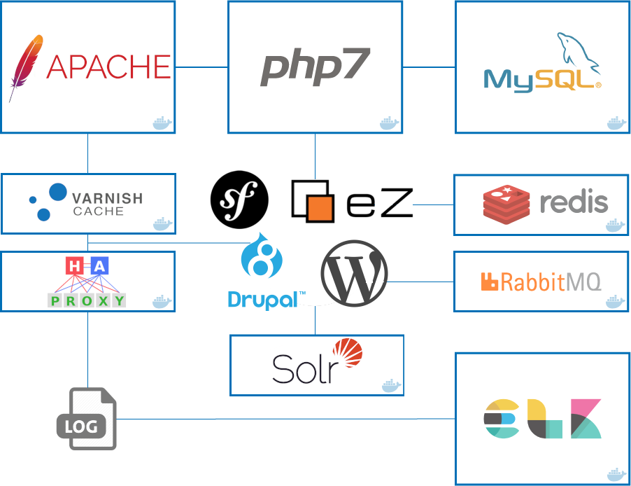

# Docker stack for development projects

[](https://travis-ci.org/psykoterro/Docker-dev-stack)
:octocat:
[](LICENSE)
[](https://github.com/psykoterro/Docker-dev-stack/issues)
[](http://hits.dwyl.io/psykoterro/Docker-dev-stack)



## Basic info

* [Apache](http://apache.org/)
* [PHP](http://php.net/)
* [MySQL](https://www.mysql.com/)
* [Redis](https://redis.io/)
* [Elasticsearch](https://www.elastic.co/products/elasticsearch)
* [Logstash](https://www.elastic.co/products/logstash)
* [Kibana](https://www.elastic.co/products/kibana)
* [RabbitMQ](https://www.rabbitmq.com/)
* [Solr](http://lucene.apache.org/solr/)
* [Varnish](https://varnish-cache.org/)
* [HaProxy](http://www.haproxy.org/)

## Previous requirements

This stack needs [docker](https://www.docker.com/) and [docker-compose](https://docs.docker.com/compose/) to be installed.

## Installation

1. Create a `.env` file from `.env.dist` and adapt it according to the needs of the application

    ```sh
    $ cp .env.dist .env && nano .env
    ```

2.  Due to an Elasticsearch 6 requirement, we may need to set a host's sysctl option and restart ([More info](https://github.com/spujadas/elk-docker/issues/92)):

    ```sh
    $ sudo sysctl -w vm.max_map_count=262144
    ```

3. Update your system's hosts file with your desired host 
   1. sfdev for Symfony 3 
   2. sf4dev for Symfony 4 
   3. dpdev for Drupal
   4. wpdev for Wordpress
   5. ezdev for ezpublish

6. (Optional) Xdebug: Configure your IDE to connect to port `9001` with key `PHPSTORM`

## How does it work?

We have the following *docker-compose* built images:

* `apache`: The Apache webserver container in which the application volume is mounted.
* `php`: The PHP container in which the application volume is mounted too.
* `mysql`: The MySQL database container.
* `elk`: Container which uses Logstash to collect logs, send them into Elasticsearch and visualize them with Kibana.
* `redis`: The Redis server container.
* `rabbitmq`: The RabbitMQ server/administration container.
* `varnish`: The Varnish server container.
* `solr`: The Solr server/administration container.
* `haproxy`: The HaProxy server container.

Running `docker-compose ps` should result in the following running containers:

```
           Name                          Command               State              Ports
--------------------------------------------------------------------------------------------------
509a6f18d55d        meg4r0m/alpine-haproxy   "/root/bootstrap.sh"     19 seconds ago      Up 18 seconds       443/tcp, 0.0.0.0:80->80/tcp, 8000/tcp                                                        haproxy
1748a25e8f11        sebp/elk                 "/usr/local/bin/star…"   20 seconds ago      Up 19 seconds       0.0.0.0:5044->5044/tcp, 0.0.0.0:5601->5601/tcp, 0.0.0.0:9200->9200/tcp, 9300/tcp             container_elk
c3f7ab321d05        klabs/varnish            "/root/bootstrap.sh"     20 seconds ago      Up 19 seconds       0.0.0.0:81->81/tcp, 6082/tcp                                                                 container_varnish
da6e44aab27a        meg4r0m/alpine-php-cli   "/run/bootstrap.sh"      21 seconds ago      Up 20 seconds                                                                                                    container_php
00ef0dc0ceba        meg4r0m/alpine-solr      "/root/bootstrap.sh"     22 seconds ago      Up 20 seconds       0.0.0.0:8983->8983/tcp                                                                       container_solr
fdb8687774ad        meg4r0m/alpine-apache    "/root/pre-init.d/bo…"   22 seconds ago      Up 20 seconds       0.0.0.0:82->82/tcp, 80/tcp, 443/tcp, 0.0.0.0:88->88/tcp                                      container_web
77ea9819de3b        mysql                    "docker-entrypoint.s…"   5 hours ago         Up 21 seconds       0.0.0.0:3306->3306/tcp, 33060/tcp                                                            container_mysql
d7d901670197        rabbitmq:3-management    "docker-entrypoint.s…"   5 hours ago         Up 20 seconds       4369/tcp, 5671/tcp, 0.0.0.0:5672->5672/tcp, 15671/tcp, 25672/tcp, 0.0.0.0:15672->15672/tcp   container_rabbit
d16a436a4430        redis:alpine             "docker-entrypoint.s…"   5 hours ago         Up 21 seconds       0.0.0.0:6379->6379/tcp                                                                       container_redis
```

## Usage

Once all the containers are up, our services are available at:

* Your app: `http://<folder>.sf4dev`
* Mysql server: `mysql:3306`
* Redis: `redis:6379`
* Elasticsearch: `elastic:9200`
* Kibana: `http://<folder>.sf4dev:5601`
* RabbitMQ: `http://<folder>.sf4dev:15672`
* Log files location: *logs/apache* and *logs/*

---

:tada: Now we can stop our stack with `docker-compose down` and start it again with `docker-compose up -d`
